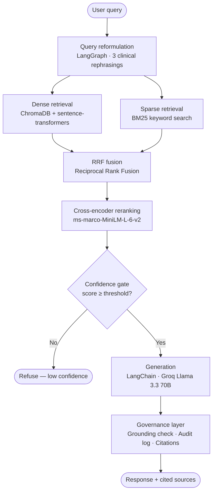

# FDA Drug Label Clinical Query System

A retrieval-augmented generation (RAG) system for querying FDA-approved drug labels using natural language. Designed to support clinical prescribing decisions by surfacing contraindications, warnings, drug interactions, and dosing considerations from official FDA label content.

**Live demo:** [Hugging Face Spaces](https://huggingface.co/spaces/DylanLe37/RAG-Query-System)

> **Disclaimer:** This system is a prototype for demonstration only. It is not intended for clinical use.

---

## Use Case

A clinician wants to prescribe drug A to a patient with condition B. Rather than manually cross-referencing a 40-page FDA label PDF, they query this system in natural language and receive a cited, grounded answer drawn directly from official label content.

**Example query:**
> *"Can I prescribe metformin to a diabetic patient with stage 3 chronic kidney disease?"*

**System response:**
> Metformin is contraindicated in patients with severe renal impairment (eGFR below 30 mL/min/1.73 m²) [Metformin Hydrochloride — Contraindications, Source 1]. For stage 3 CKD patients with eGFR 30–59, the label notes that plasma half-life is prolonged and renal clearance decreases proportionally with creatinine clearance [Metformin Hydrochloride — Clinical Pharmacology, Source 5]...

The architecture is domain-agnostic, the FDA corpus is a proxy for any kind of proprietary or internal documents that would power a production deployment at an organization.

---

## Architecture


### Key design decisions

**Hybrid retrieval over pure dense search.** Dense semantic search (ChromaDB + sentence-transformers) captures conceptual similarity but can miss exact clinical terms like drug names and numeric thresholds. BM25 keyword search handles these precisely. RRF fusion consistently outperforms either alone.

**Query reformulation via LangGraph.** FDA label terminology often differs from clinical shorthand. A query about "kidney disease" may not match a label section written around "renal impairment" or "eGFR thresholds." LangGraph generates three clinical rephrasings before retrieval, improving recall on terminology-sensitive queries.

**Cross-encoder reranking.** Initial retrieval returns 20 candidates per method. A cross-encoder reranker (ms-marco-MiniLM-L-6-v2) rescores these against the original query — more accurate than cosine similarity but too slow to run over the full corpus. Running it only over the fused candidate set keeps latency under low.

**Confidence gating as a model risk control.** The system refuses to generate an answer rather than hallucinate when retrieval quality is low. In a production clinical decision support deployment, a confident wrong answer is worse than an explicit refusal.

**Section-aware chunking.** Rather than splitting on token count, the ingestion pipeline chunks by FDA label section (contraindications, warnings, drug interactions, etc.) with sentence-boundary overlap. This preserves coherence and enables section-level retrieval recall measurement in evaluation.

---

## Evaluation

Evaluated on a 34-question labeled test set spanning four question types: positive (drug/condition findings exist), negative (no finding for the queried combination), partial negative (related but not identical finding exists), and gate trigger (drug not in corpus).

### RAGAS scores (positive + partial negative questions)

| Metric | Score |
|---|---|
| Faithfulness | 0.91 |
| Answer relevancy | 0.88 |
| Context recall | 0.65 |

Faithfulness of 0.91 is the most clinically significant metric, indicating generated answers contradicted or fabricated beyond the retrieved context less than 10% of the time. Similarly, the answer relevancy of 0.88 shows the system generally answers the question being asked without getting sidetracked on random tangents.

Context recall of 0.65 is partially driven by label structure inconsistency in the openFDA dataset rather than retrieval failure. Several FDA labels index identical content under `warnings` vs `warnings_and_cautions` depending on label version, so the retriever surfaces the correct content but the section name doesn't match the expected label, penalizing the metric.

### Retrieval recall by question type

| Question type | Recall | Refusal rate | n |
|---|---|---|---|
| Positive | 76.2% | 4.8% | 21 |
| Negative | 80.0% | 20.0% | 5 |
| Partial negative | 66.7% | 33.3% | 3 |
| Gate trigger | 100.0% | 100.0% | 5 |

Gate trigger recall of 100% indicates the confidence gate correctly refused all queries for drugs outside the corpus. The refusal rate on partial negative questions (33.3%) indicates the confidence threshold is slightly aggressive, but we err on the side of caution in a medical setting.

---

## Governance and Model Risk

This project was designed with model risk management (MRM) principles in mind, reflecting the regulatory requirements for AI systems deployed in enterprise contexts.

**Explainability.** Every response cites the specific drug name and label section it draws from. Responses are traceable to a specific chunk in the corpus.

**Confidence gating.** The system refuses to answer rather than generate a low-confidence response. This is a direct analog to model risk controls that require a human override path when model confidence is insufficient.

**Grounding verification.** A secondary LLM scores each response for faithfulness to the retrieved context, flagging responses that go beyond what the sources support.

**Audit logging.** Every query, retrieved context, generated response, confidence scores, and grounding check result is written to a structured JSONL audit log. This provides the full evidentiary record an MRM team would require before approving a system for production use.

**Evaluation framework.** A labeled test set with four question types (positive, negative, partial negative, gate trigger) measures behavior across the full response surface of the system, not just the easy cases.

---

## Tech Stack

| Component | Technology |
|---|---|
| LLM | Groq Llama 3.3 70B |
| Embeddings | sentence-transformers/all-MiniLM-L6-v2 |
| Reranker | cross-encoder/ms-marco-MiniLM-L-6-v2 |
| Vector store | ChromaDB |
| Sparse retrieval | BM25 (rank-bm25) |
| Orchestration | LangChain + LangGraph |
| Evaluation | RAGAS |
| UI | Gradio |
| Deployment | Hugging Face Spaces |
| Corpus | openFDA Drug Label API |

---

## Project Structure

```
fda-rag/
├── src/
│   ├── ingest.py        # Corpus ingestion, chunking, indexing
│   ├── retriever.py     # Hybrid retrieval pipeline (LangGraph)
│   ├── chain.py         # Generation chain with governance layer
│   └── eval.py          # RAGAS evaluation suite
├── eval/
│   └── eval_set.json    # 34 labeled Q&A pairs
├── app.py               # Gradio UI (HF Spaces entry point)
├── build_eval_set.py    # Script used to generate eval_set.json
└── requirements.txt     # Pinned dependencies
```

---

## Setup and Reproduction

### Prerequisites

- Python 3.12
- Groq API key
- Hugging Face account

### Installation

```bash
git clone https://github.com/DylanLe37/RAG-Query-System
cd fda-rag
python -m venv venv
source venv/bin/activate
pip install -r requirements.txt
```

### Configuration

Create a `.env` file at the project root:

```
GROQ_API_KEY=your_key_here
HUGGINGFACE_TOKEN=your_token_here
```

### Build the corpus

```bash
python src/ingest.py
```

Fetches 1,000 FDA drug labels from openFDA, chunks by section, builds ChromaDB and BM25 indexes. Takes approximately 10 minutes on first run. Subsequent runs use a local cache.

### Run the app locally

```bash
python app.py
```

### Run evaluation

```bash
python src/eval.py
```

Runs all 34 questions through the pipeline and scores with RAGAS. Requires ~100,000 Groq tokens (free tier daily limit). Results cached to `eval/eval_results.json` so RAGAS scoring can be rerun independently.
